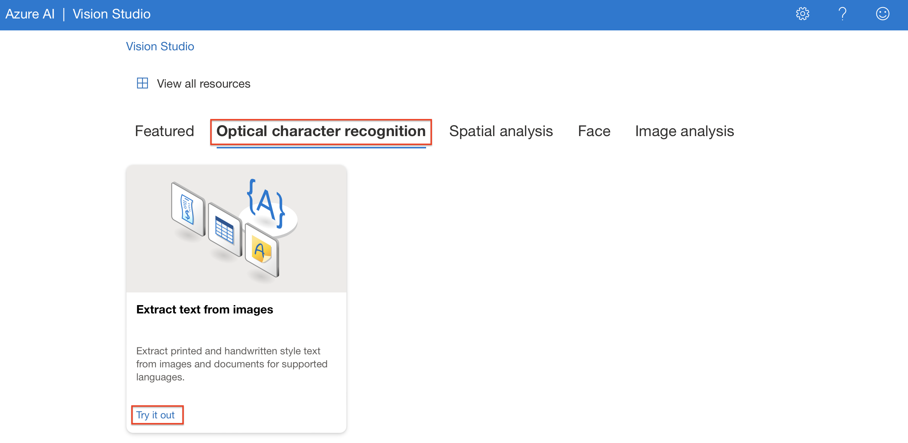
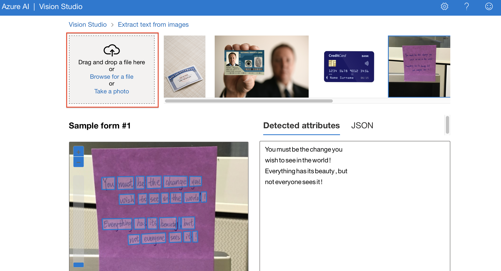
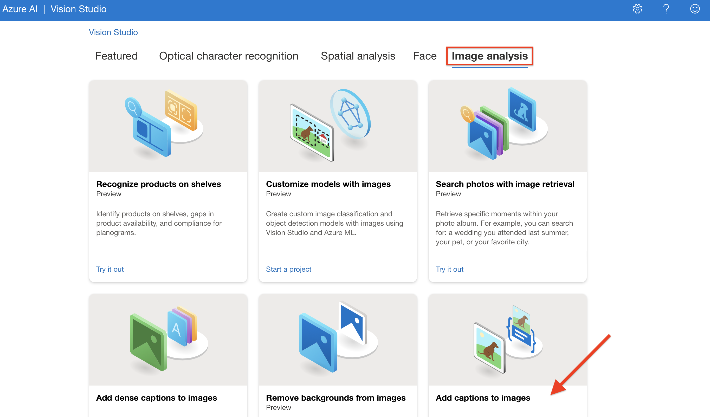
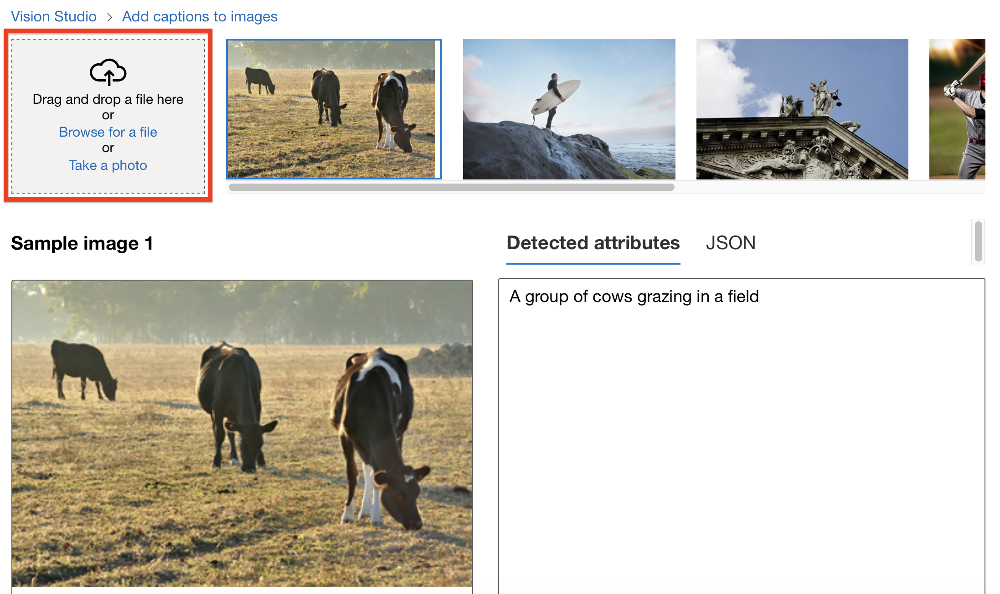

# Trabalhando com Visão Computacional 🤖

Durante o lab proposto, pude aprender e aprimorar habilidades ao utilizar ferramentas de visão computacional Azure, tais como reconhecimento facial, reconhecimento óptico de caracteres (OCR) e análise de imagem.

## OCR - Reconhecimento Óptico de Caracteres 

A ferramenta tem por objetivo a extração de texto de imagens em que é possível identificar palavras/letras. 

Para utilizar a ferramenta, após acessar o [Studio Vision](https://portal.vision.cognitive.azure.com) você irá selecionar a aba **Optical** **Character** **Recognition**, e quando a caixa com a opção "Extract text from images" aparecer, clicamos em *Try* *it* *out*.

Já na ferramenta, é possível experimentar utilizando as imagens disponíveis, ou então adicionar suas próprias imagens para experimento. 

## Análise de imagem - Adicionar legendas à imagem

Já em relação a ferramenta de adição de legendas à imagem, temos uma função bastante interessante onde o computador, a partir da análise da imagem, irá gerar uma descrição sobre o conteúdo que está sendo exibido.

No portal do [Studio Vision](https://portal.vision.cognitive.azure.com) você irá selecionar a aba **Imagem analysis**, e na opção "Add captions to images" clicar em *Try out*.

Uma vez na ferramenta, é possível explorar as opções oferecidas para teste, ou então adicionar suas próprias imagens e experimentar as funcionalidades do programa.

## 📝 Considerações 

As ferramentas de visão computacional são recursos de grande funcionalidade, permitindo uma quantidade enorme de possibilidade e soluções a partir de seu uso, tais como extração rápida de informações de documentos, descrição de imagens facilitando recursos de acessibilidade, detecção facial eficiente permitindo o aprimoramento de sistemas de segurança, e inúmeras outras possibilidades.    
