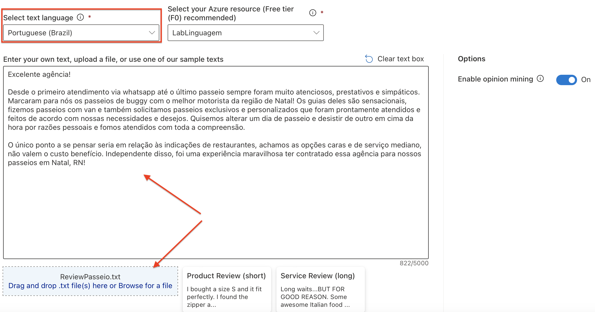
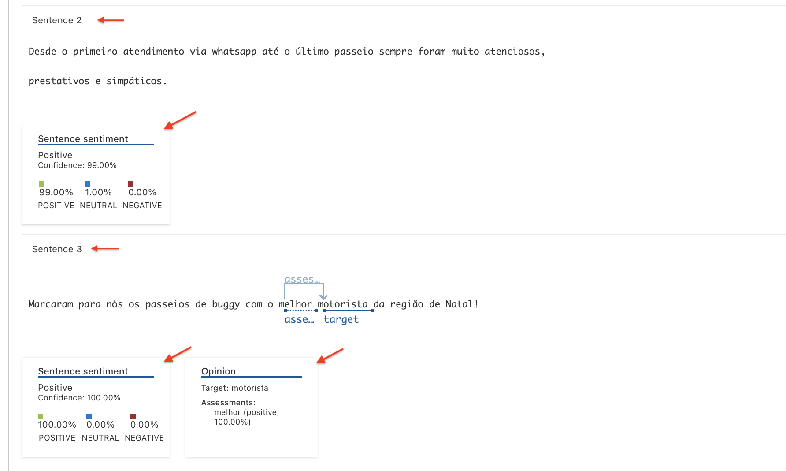

# Análise de sentimento e mineiração de opinião

Esse recurso de linguagem permite que o texto seja analisado afim de perceber o sentimento do usuário que o escreveu - se foi positivo, negativo, se apresentou tom ofensivo, entre outras possibilidades. Esse recurso, quando pensamos em uma escala maior, como um grupo de avaliações de um restaurante, ou comentários a respeito de um novo produto lançado, permite análises mais profundas, como o bom ou mau desempenho de determinado produto, pontos a serem melhorados em um estabelecimento, e muito mais. 

## 👩‍💻  Utilizando a ferramenta:

Dentro do [Language Studio](https://language.cognitive.azure.com), vamos selecionar a guia "Classify text", e entre as opções que serão exibidas vamos localizar a **Analyze sentiment and mine opinions**, e clicar em *Try out*.

Dentro da ferramenta devemos primeiramente selecionar a língua do texto que pretendemos analisar, e na sequência podemos copiar e colar o conteúdo direto na caixa de texto, ou então podemos adicionar um arquivo de texto.

Uma vez adicionado o texto, vamos executar a função clicando em **Run**. Os resultado serão exibidos logo abaixo, onde podemos visualizar a análise de sentimentos do documento como um todo, ou então observar a análise individual de cada sentença, como é possível observar nas imagens abaixo.

## Considerações 💭

A ferramenta, além de prática e intuitiva, permite análises que podem ser aproveitadas em diversos segmentos do mercado, trazendo uma percepção que pode ser obtida em grande escala de clientes e consumidores. Também pode ser bem aproveitada como um recurso de segurança, afim de colaborar na identificação de discursos de ódio, ataques e ofensas que possam ocorrer em fóruns e redes sociais. 