# Azure Cognitive Search 🔎

Primeiramente, no [portal do Azure](https://portal.azure.com) devemos criar um novo recurso de **Azure Ai Search**, e então um novo recurso de **Azure AI Service**. Tendo isso feito, vamos criar uma conta de armazenamento, selecionado a opção Storage Accounts.

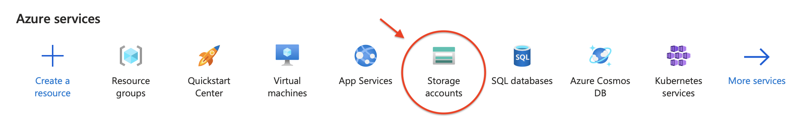

Após criando, devemos acessar às configurações do Storge Account criado, afim de realizar algumas alterações necessária para esse exercício de lab específico. Para isso, vamos em Settings > Configuration e na sequência vamos selecionar a opção que permite o acesso de Blob anônimo. 

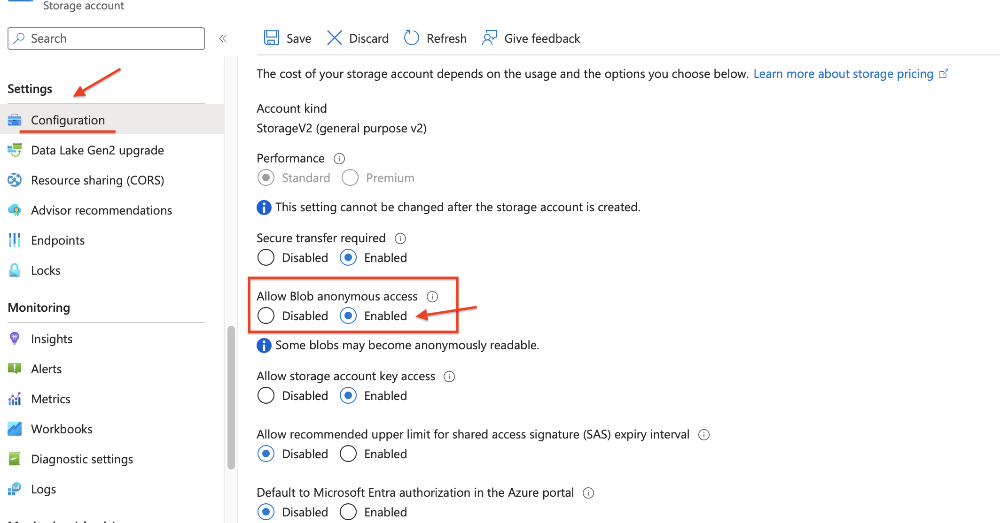

O próximo passo será clicar na aba Data Storage e em seguida na opção Containers, nós iremos criar e adicionar um novo container, e na caixa com a opção "Anonymous access level", vamos selecionar "Container (anonymous read acces for containers and blobs)".

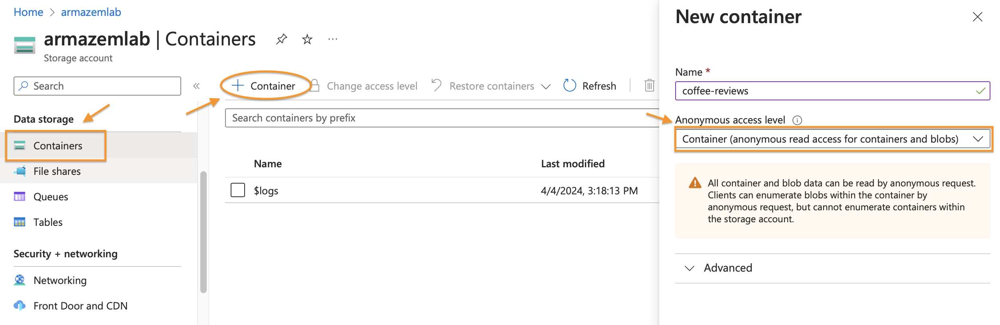

Entrando no container criado, faremos o upload da pasta que contém os arquivos/dados que serão análisados durante o expertimento.

Vamos agora abrir o recurso de busca que criamos e na página "Overview" vamos selecionar a opção "Import data". Quando a página **Connect to your data** abrir, na caixa **Data Source** vamos escolher a opção **Azure Blob Storage**.

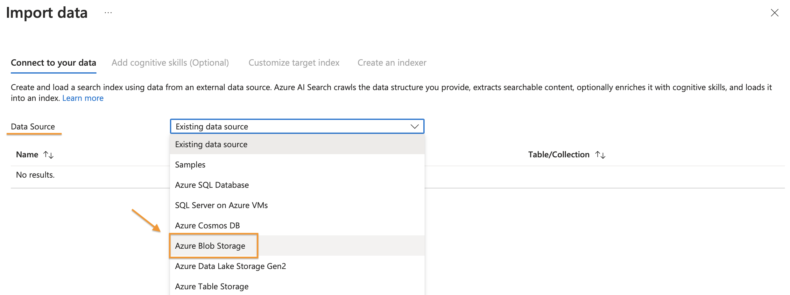

Vamos completar a configuração com os seguintes dados:

* Data Source: Azure Blob Storage
* Data source name: coffee-customer-data
* Data to extract: Content and metadata
* Parsing mode: Default
* Connection string: Clicar em "Select Choose an existing connection", e selecionar o storage account criado, na sequência selecionar o container criado. 
* Managed identity authentication: None
* Container name: Após selecionar o container nos passos anteriores, esse campo será preenchido automaticamente.
* Blob folder: Deixar em branco.
* Description: Escrever uma descrição de sua escolha.

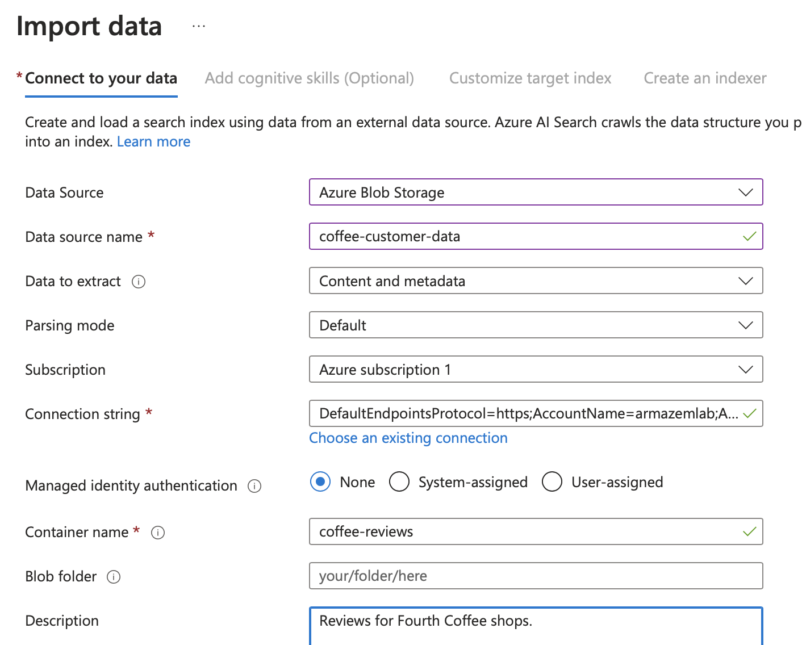

Para dar sequência, vamos clicar no botão azul com o comando **Next: Add cognitive skills (Optional)**, e nessa página veremos algumas opções de configuração, vamos primeiramente selecionar **Attach AI Services** e selecionar o recurso de AI Service que foi criado para tal. 

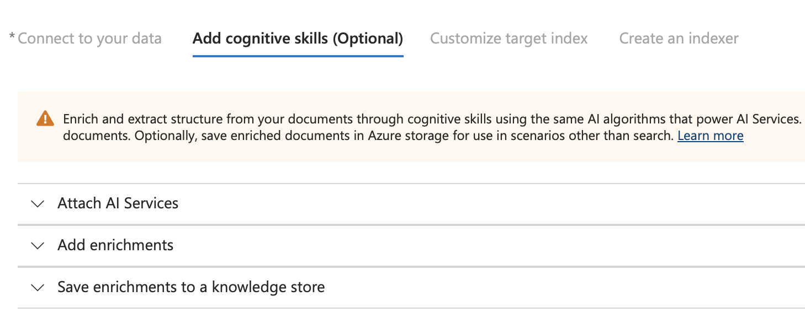

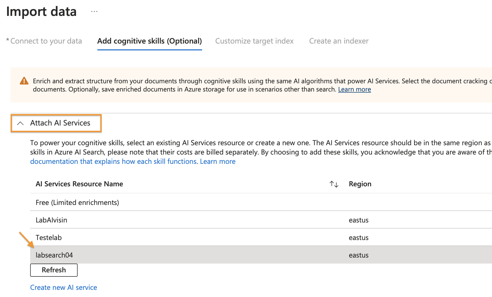

Depois seguiremos para as configurações da guia **Add enrichments**, onde é importante a atenção aos detalhes de configuração. 

* Skillset name: aqui mudamos para **coffee-skillset**
* Selecionar a caixa "Enable OCR and merge all text into merged_content field"
* Source data field: merged_content
* Enrichment granularity level: Pages (5000 character chunks)
* Não selecionar a caixa "Enable incremental enrichment"

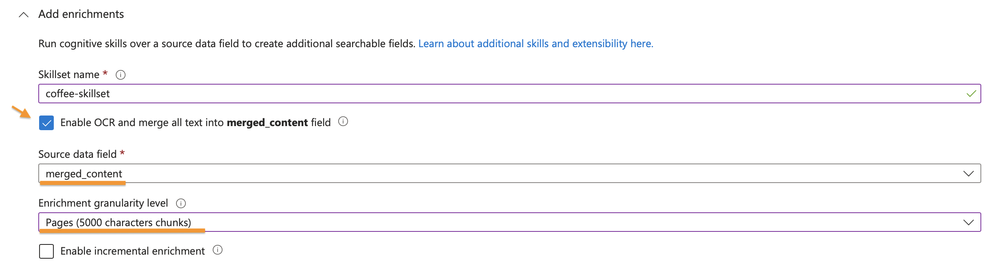

Nos campos de enriquecimento, para o exercício vamos selecionar: 

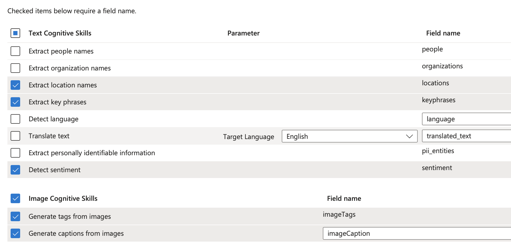

Seguimos então para o último parâmetro de configuração, o **Save enrichments to a knoledge store**. Aqui vamos selecionar as seguintes opções:

* Image projections
* Documents
* Pages
* Key phrases
* Entities
* Image details
* Image references

Caso uma imagem de erro apareça, faremos os seguintes passos:

a) Selecionar "Choose an existing connection" e escolher a storage account criada anteriormente;

b) Clicar em **+ Container** e criar um novo container chamdo **knowledge-store** com o nível de privacidade em "privado";

c) Selecionar o container **knowledge-store** e clicar em **Select**.

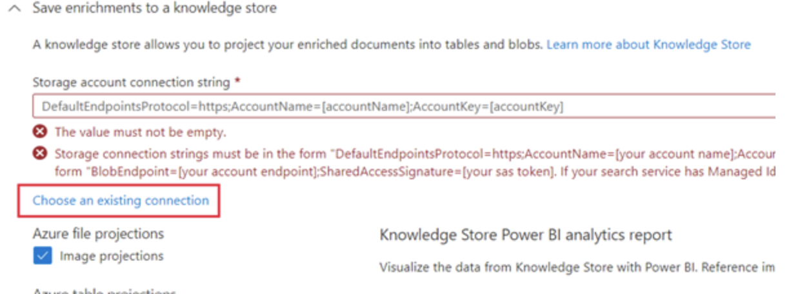

Dando sequência as configurações, selecionamos a caixa **Document** logo abaixo de Äzure blob projections", e caso o nome do novo container (knowledge-store) apareça na caixa "Container name", pode manter dessa forma.

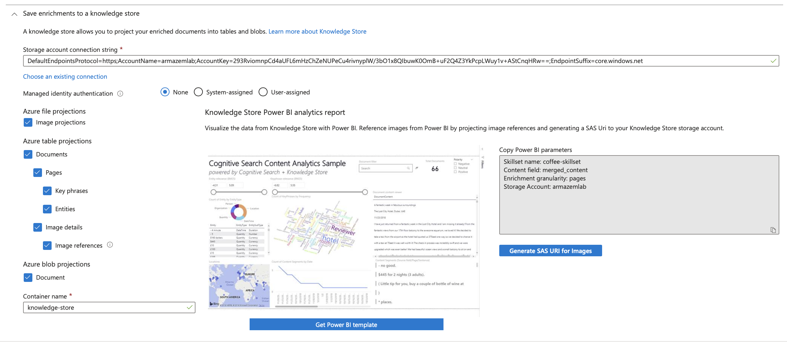

Seguimos para **Customize target index**, onde devemos observar as seguintes configurações:

* Key: metadata_storage_path
* Suggester name: deixar em branco
* Search mode: manter a opção padrão

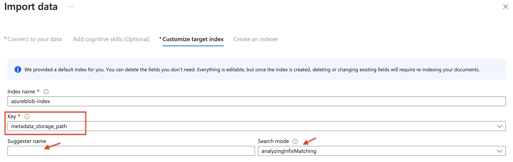

Na lista de opções abaixo, vamos observar quais já estão automáticamente selecionadas, nessas iremos selecionar também o campo "filterable".

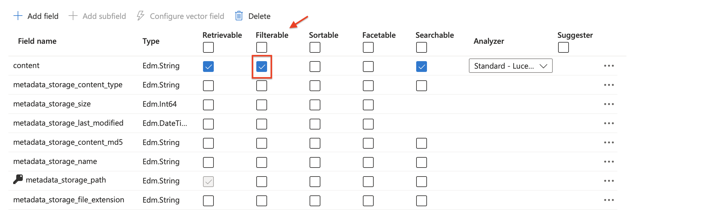

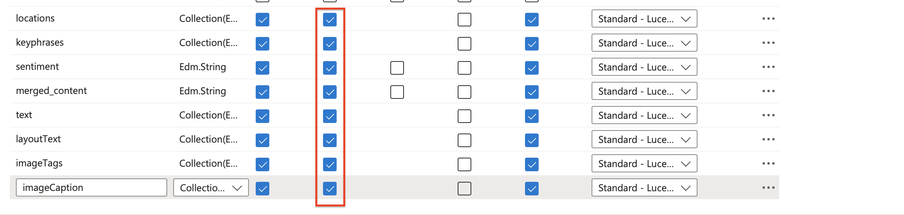

Na próxima etapa, na guia **Create an indexer**, vamos mudar o campo **Indexer name** para o nome relacionado ao exercício, no caso "coffee-indexer". No campo **Schedule** vamos manter selecionado a opção **Once** e na sequência vamos expandir as opções avançadas para conferir que a opção **Base-64 Encode Keys** está selecionada, podemos então clicar em **Submit**.

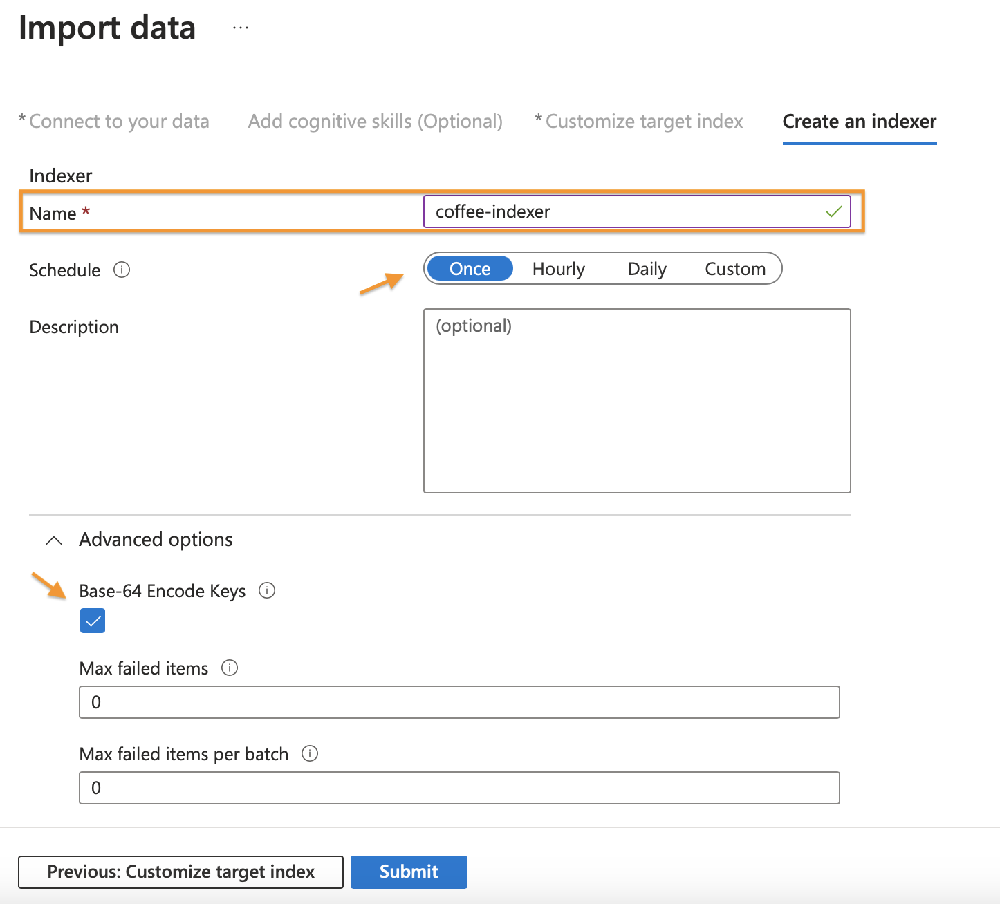

Uma vez finalizada essa etapa vamos abrir novamente o Azure AI Search, na barra à esquerda, no menu **Search Management** vamos selecionar a opção **Indexers**. Lá vamos clicar na nossa recém criada **coffee-indexer**, uma vez aberta podemos ver mais detalhes e verificar o status de sucesso. 

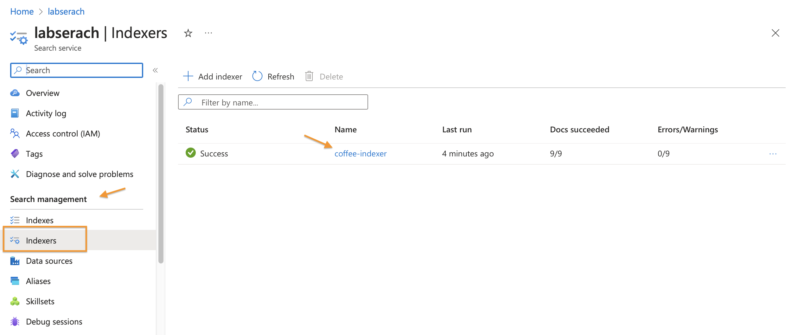

Finalmente vamos poder explorar a ferramenta **Search explorer** com o objetivo de testar opções de busca. A opção pode ser encontrada  dentro do Azure AI Search  clicando na opção **Overview** do menu lateral.

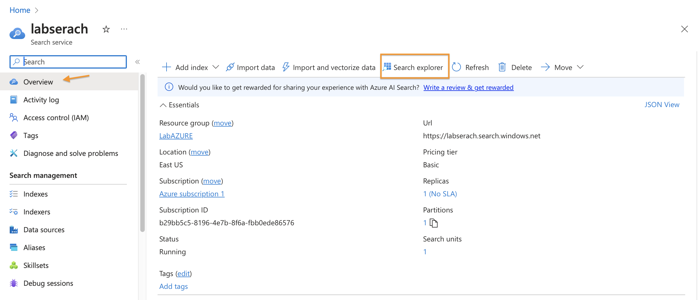

Na ferramenta podemos conferir se o a informação no Index está correta e clicar em "view" para mudar para JSON, com isso o campo de texto ficará disponível, e lá será possível realizar as buscas por meio de palavras chave, como localização e sentimentos.

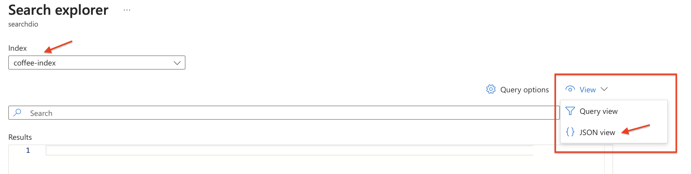

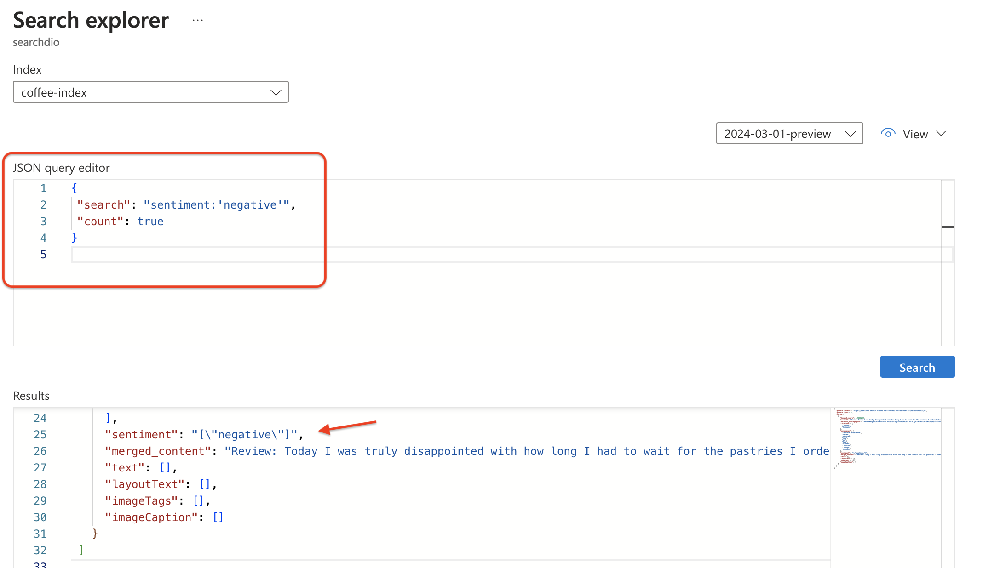

