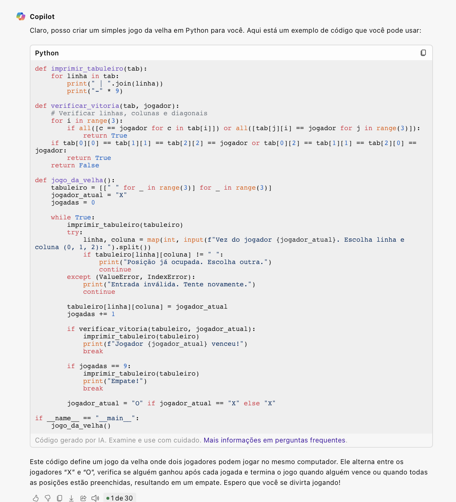
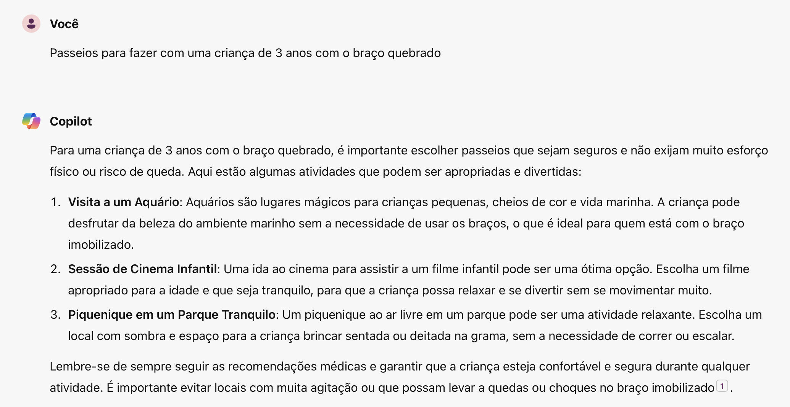
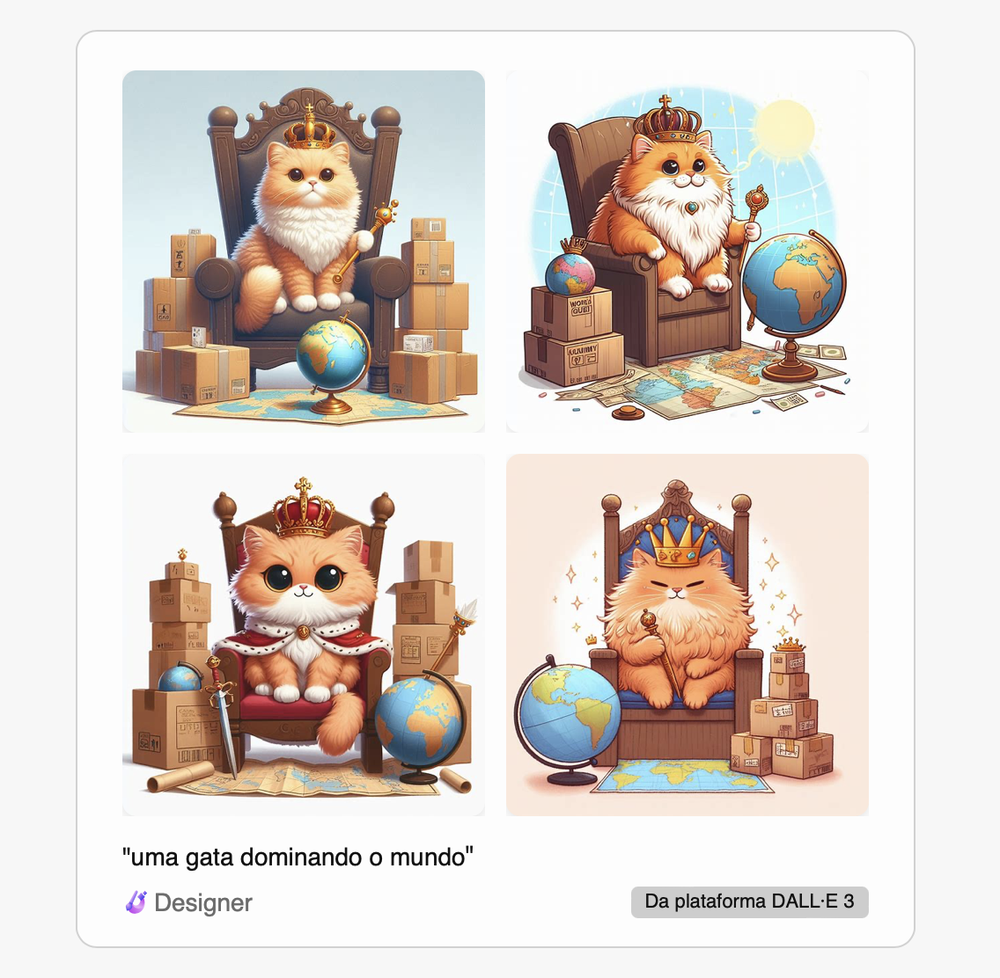

# IA Generativa 🤖

No último laboratório do Bootcamp foi possível explorar funcionalidades de IA Generativa, utilizando recursos do **Copilot** da Microsoft. Como forma de exploração, realizei alguns pedidos ao programa, tais como:

# 1 - Pedi para que fossem criado um código em Python para um jogo da velha:

# 2 - Pedi que fossem realizadas algumas sugestões de passeios para realizar com uma criança com o braço quebrado:

# 3 - Por último, solicitei a criação de uma imagem que demonstrasse uma gata dominando o mundo:

