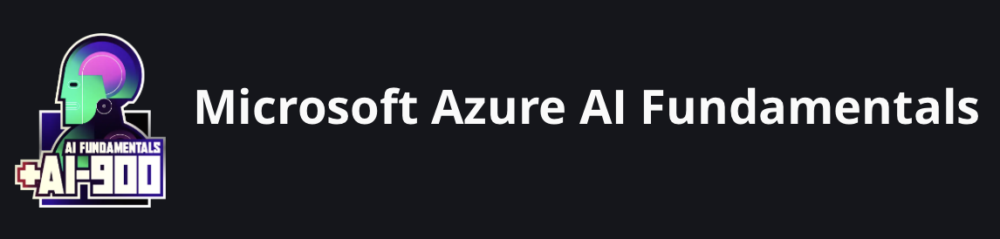

# Bootcamp DIO - Microsoft Azure AI Fundamentals

Repositório destinado ao armazenamento de projetos realizados no Bootcamp **Microsoft AI Fundamentals**, oferecido pela [DIO](https://www.dio.me).

- [Projeto 01 - Machine Learning](https://github.com/Gabee-p/LabAzure-MachineLearning/tree/main/LAB01%20-%20Machine%20Learning)
- [Projeto 02 - Ferramentas de visão computacional](https://github.com/Gabee-p/LabAzure-MachineLearning/tree/main/LAB02%20-%20Visao%20Computacional)

